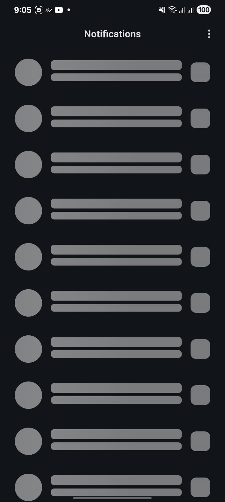
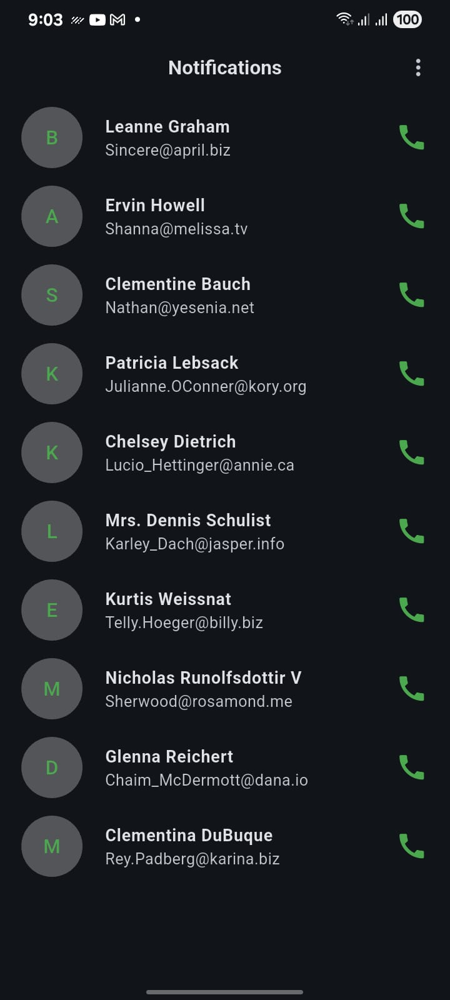
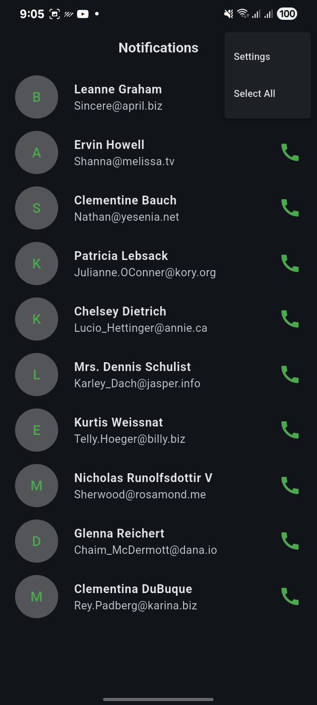
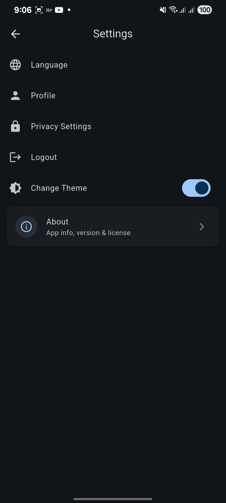
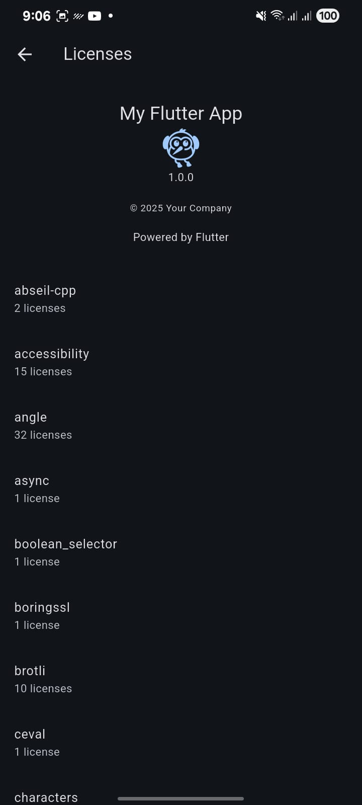
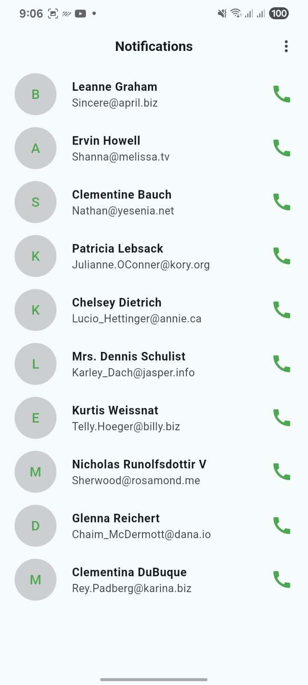
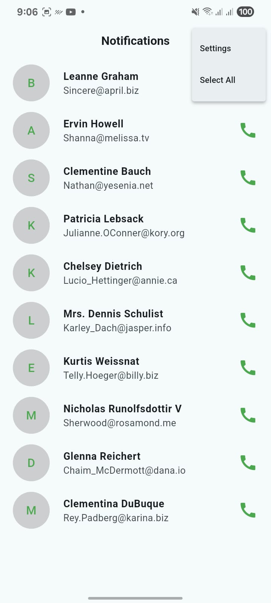
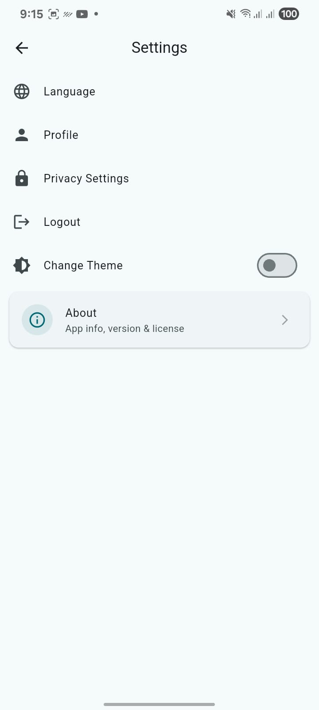

 <h1>🏠 Fetch API </h1>
  
  
  
  
  
  
  

A modern property marketplace app built with Flutter, featuring a clean UI, dark/light themes, API integration, and smooth loading effects. Perfect for showcasing houses, apartments, and flats with detailed property listings.

📱 Screenshots
🏡 Home Screen – Dark Theme

    
 
    

🏡 Home Screen – Light Theme

    

🚀 Features

✨ Modern Flutter UI – Minimal, responsive, and clean design.
🌙 Theme Controller – Toggle seamlessly between Dark Mode & Light Mode.
⚡ API Integration – Fetch live property listings from REST APIs.
💫 Shimmer Loading – Beautiful skeleton loaders while data fetches.
🏠 Property Listings – Display houses, apartments, and flats with images & details.
📖 Property Details Page – View complete details with smooth navigation.
🔎 Search & Filter (Planned) – Quickly find the property you want.
❤️ Favorites (Planned) – Save your preferred listings for later.

🛠️ Getting Started

This project is a starting point for a Flutter application.

Lab: Write your first Flutter app

Cookbook: Useful Flutter samples

For more help, view the official Flutter documentation
.

🤝 Contributing

Contributions are always welcome! 🎉
If you’d like to fix a bug, request a feature, or enhance the UI, feel free to open an issue or submit a pull request.

⭐ Show Your Support

If you like this project, give it a star ⭐ on GitHub.
Your support helps the project grow and reach more developers! 🚀
